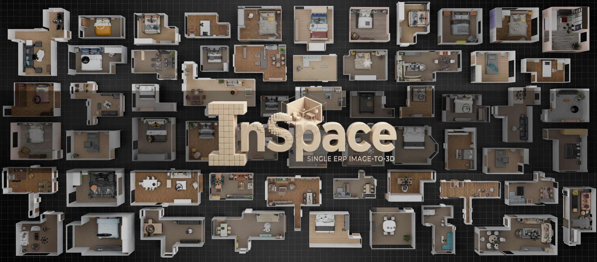

<div align="center">

# InSpace: Structure-Aware 3D Indoor Scene Generation from a Single 360° Image

<a href="#"></a>
<a href="https://kookie12.github.io/InSpace-Project-Page/"></a>
<a href="https://huggingface.co/GwanHyeong/InSpace"></a>
<a href="https://huggingface.co/datasets/GwanHyeong/ERP-FRONT-30K"></a>
<a href="LICENSE"></a>

<em>ECCV 2026 · Malmö, Sweden</em>

<p>
<a href="https://kookie12.github.io/">Gwanhyeong Koo</a><sup>1,2 *</sup>,
<a href="https://blandocs.github.io/">Hyunsu Kim</a><sup>2</sup>,
Youngji Kim<sup>2</sup>,
Taejae Lee<sup>2</sup>,
<br>
<a href="https://siw00-lim.github.io/">Siwoo Lim</a><sup>1</sup>,
<a href="https://dbstjswo505.github.io/">Sunjae Yoon</a><sup>3</sup>,
Suyong Yeon<sup>2 †</sup>,
<a href="https://sanctusfactory.com/family.php">Chang D. Yoo</a><sup>1 †</sup>
</p>
<p>
<sup>1</sup> KAIST &nbsp;&nbsp; <sup>2</sup> NAVER LABS &nbsp;&nbsp; <sup>3</sup> Chung-Ang University
<br>
<sub><sup>*</sup> Work done during an internship at NAVER LABS. &nbsp;&nbsp; <sup>†</sup> Co-corresponding authors.</sub>
</p>




</div>

**InSpace** generates a complete, **asset-aware** 3D indoor scene from a **single 360° (equirectangular)
panorama**, producing a full-room mesh along with individual, separable, textured furniture meshes. It is built on the [TRELLIS.2](https://github.com/microsoft/TRELLIS.2) O-Voxel
representation and extends it with a panorama-native, **structure-aware** generation pipeline:
view-selective cross-attention driven by the camera center, layout-guided structure
inversion from monocular depth, a 3D bounding-box estimator, and asset-aware shape and texture
generation with global-local hybrid attention.


<!-- ## 📝 Abstract

Recent advances in single image-to-3D generation have enabled high-quality asset synthesis, yet
extending these capabilities to indoor scene generation remains challenging. Existing methods focus
on asset-level generation while neglecting the structural layout, which is essential for downstream
applications and serves as the spatial anchor for grounding assets. However, a single image with a
limited field of view lacks the spatial coverage to recover a coherent global layout. To this end,
we use a 360° image represented in equirectangular projection (ERP) and propose **InSpace**, a
structure-aware framework for 3D indoor scene generation. InSpace comprises three stages: (1)
estimating partial scene geometry as spatial priors, (2) generating coarse scene structure with
view-selective cross-attention, and (3) producing detailed layout and asset geometry with textures
through a global-local hybrid attention, using flow matching. We also propose **ERP-FRONT**, a
paired ERP-Image-to-3D indoor scene dataset based on 3D-FRONT. Experiments show that InSpace
generates complete 3D indoor scenes with structural layout, along with separate textured assets
from a single ERP image, achieving strong performance across 3D and 2D metrics.
 -->

## ✨ Highlights

- **Single 360° image to full 3D room.** No multi-view capture, no per-scene optimization.
- **Asset-aware output.** The scene is decomposed into a *layout* (floor and walls) and *individual
  objects*, each exported as its own mesh, not a single fused blob.
- **Structure-aware conditioning.** A 360° panorama is unwrapped into 6 cubemap faces (FOV 120°),
  and each voxel attends only to the faces visible from its 3D position, via a camera-center
  conditioned **view-selective cross-attention**.
- **Layout-Guided Structure Inversion.** A monocular-depth (Depth-Anything-2) point
  cloud, the *Partial Scene Geometry (PSG)*, seeds coarse generation via SDEdit-style noise
  inversion, improving room-scale fidelity.


## 🗓️ Roadmap

- ✅ Pretrained checkpoints on Hugging Face ([`InSpace`](https://huggingface.co/GwanHyeong/InSpace))
- ✅ ERP-FRONT-30K dataset on Hugging Face ([`ERP-FRONT-30K`](https://huggingface.co/datasets/GwanHyeong/ERP-FRONT-30K))
- ✅ Interactive Gradio demos (ERP-FRONT / Structured3D / ReplicaPano / custom)
- ✅ Inference & evaluation pipeline
- ✅ Training scripts (`scripts/train/`)
- ⬜ Dataset preprocessing pipeline (`data_toolkit/erp/`)
<!-- - ⬜ arXiv paper
- ⬜ Colab / Hugging Face Space demo -->


## 🗺️ Pipeline

```
Single 360° ERP panorama
        │  depth estimation + ERP back-projection
        ▼
Stage 1 · Partial Scene Geometry (PSG)      spatial prior + calibrated camera center
        │  unwrap to 6 cubemap faces (FOV 120°), view-selective cross-attention
        ▼
Stage 2 · Coarse Scene Geometry (flow matching)   ->   voxel scene [1,64,64,64]
        │  3D bounding-box detector   ->   per-asset oriented boxes (OBBs)
        ▼
Stage 3 · Detailed Layout & Asset generation (global-local hybrid attention)
        ▼
textured scene mesh:  scene.glb  +  layout.glb  +  assets/{i}.glb
```

The four trainable components correspond to the four released checkpoints (see
[Pretrained Weights](#-pretrained-weights)).


## 🛠️ Installation

InSpace uses the **same environment as TRELLIS.2** (PyTorch 2.6 / CUDA 12.4 recommended).

### Prerequisites
- **OS:** Linux. **GPU:** NVIDIA with at least 24 GB VRAM (tested on A100 / H100).
- [CUDA Toolkit](https://developer.nvidia.com/cuda-toolkit-archive) 12.4, [Conda](https://docs.anaconda.com/miniconda/), Python 3.8 or newer.

### Steps
```sh
git clone <this-repo-url> --recursive
cd InSpace

# Create the `inspace` conda env and install all dependencies
. ./setup.sh --new-env --basic --flash-attn --nvdiffrast --nvdiffrec --cumesh --o-voxel --flexgemm
```
Run `. ./setup.sh --help` for the full list of flags. For GPUs without `flash-attn` support
(e.g. V100), install `xformers` and set `ATTN_BACKEND=xformers`.


## 📦 Pretrained Weights

Weights are **not committed** to this repo (size). Download them from Hugging Face into `ckpts/`
(the repo mirrors the local layout, so `--local-dir .` places them correctly):

```sh
hf download GwanHyeong/InSpace --include "ckpts/*" --local-dir .
```

InSpace uses four checkpoints plus the base TRELLIS.2 weights:

| Folder (`ckpts/…`) | Component | Role |
| :--- | :--- | :--- |
| `erp_ss_flow_img_dit_L_16l8_bf16_spatial/` | Coarse geometry | Stage 2 coarse scene structure (sparse structure) |
| `bbox_centerpoint/` | 3D BBox | Per-asset oriented bounding-box estimator |
| `erp_slat_flow_img2shape_asset_aware_bf16/` | Asset shape | Stage 3 asset-aware shape generation |
| `erp_slat_flow_imgshape2tex_asset_aware_bf16/` | Asset texture | Stage 3 asset-aware texture generation |

> The base TRELLIS.2 / TRELLIS-image-large weights are pulled automatically from Hugging Face
> (`microsoft/TRELLIS.2-4B`, `microsoft/TRELLIS-image-large`) as referenced in `configs/gen/`.

The processed dataset is released on Hugging Face as
[**ERP-FRONT-30K**](https://huggingface.co/datasets/GwanHyeong/ERP-FRONT-30K); see
[`datasets/README.md`](datasets/README.md).

```sh
hf download GwanHyeong/ERP-FRONT-30K --repo-type dataset --local-dir datasets/
```


## 🚀 Usage

### 1. Interactive demo (Gradio)

The dataset demos need the sample sets under `datasets/`. Each of the first three demos
auto-downloads its own samples from Hugging Face on first launch (the custom demo takes your
own upload instead), or you can prefetch them all manually:

```sh
hf download GwanHyeong/InSpace --include "datasets/*" --local-dir .
```

Four demos share the same pipeline and UI, differing only in the input dataset:

```sh
# ERP-FRONT test scenes (fully-supervised: GT mesh + boxes)
python demo/app_inspace_erp_front.py --port 7860

# Structured3D scenes (windows/doors opening test; full / empty variants)
python demo/app_inspace_structured3d.py --port 7861

# ReplicaPano real-scan panoramas
python demo/app_inspace_replicapano.py --port 7862

# Your own 360° panorama (upload an ERP image + its depth map)
python demo/app_inspace_custom.py --port 7863
```
Each demo walks through every stage, input panorama to layout (PSG) to coarse geometry (CSG) to
3D boxes to textured mesh.

### 2. Batch inference

`eval/pipeline/eval_pipeline.py` chains all stages end-to-end over the test set (or your own data)
and writes meshes and visualizations:

```sh
# Random-noise start, GT boxes (baseline)
python eval/pipeline/eval_pipeline.py \
    --data_dir datasets/ERP_3D_FRONT_test \
    --noise_mode random --bbox_mode gt --max_samples 8

# Layout-guided (SDEdit) start with predicted boxes (main setting)
python eval/pipeline/eval_pipeline.py \
    --data_dir datasets/ERP_3D_FRONT_test \
    --noise_mode sdedit --sdedit_alpha 0.5 --bbox_mode predicted
```
Key flags: `--noise_mode {random,sdedit}`, `--sdedit_alpha`, `--bbox_mode {gt,predicted}`,
`--layout_mode`, `--max_samples`, `--skip_existing`. Texture is always generated. The seven
convenience wrappers `eval/pipeline/run_*.sh` cover the full flow (see [`eval/README.md`](eval/README.md)).

Per-sample outputs under `evals/stage12_pipeline/{config}/{scene}/{room}/`: latents
(`shape_latent.npz`, `texture_latent.npz`, `bboxes.npz`), meshes (`meshes/{scene,layout}.glb`,
`meshes/assets/*.glb`), and render grids in `vis_pred/` (plus `vis_concat/` with `--save_concat`).


## 🗂️ Data Preparation

InSpace is trained on **ERP-FRONT**, a paired ERP-Image-to-3D indoor scene dataset built on
3D-FRONT (26.5K training and 2.5K test ERP-image-mesh pairs), stored under
`datasets/ERP_3D_FRONT` and `datasets/ERP_3D_FRONT_test`. Raw 3D-FRONT rooms are converted to the
O-Voxel representation and conditioning inputs by the scripts in
[`data_toolkit/erp/`](data_toolkit/erp/) (steps 1 to 10: mesh/PBR dumps, dual-grid O-Voxels,
shape/PBR/SS latents, cubemap rendering, depth-lifted voxels), run as two parallel tracks:
scene+assets (`*_erp`) and layout (`*_layout_wo_ceiling`). See
[`data_toolkit/erp/README.md`](data_toolkit/erp/README.md) for the full step-by-step guide,
and the expected on-disk layout in [`datasets/README.md`](datasets/README.md). Optional or
experimental variants are kept under `data_toolkit/erp/extra/`.


## 🏋️ Training

Training is driven by `train.py` (see `--help` for distributed flags). Bash wrappers set the
config and output dir for each stage:

```sh
# Coarse scene geometry (sparse structure)
bash scripts/train/stage1_ss.sh

# 3D bounding-box estimator (CenterPoint)
bash scripts/train/bbox.sh

# Asset-aware shape generation
bash scripts/train/stage2_shape.sh              # stage2_shape_resume.sh to resume
# Asset-aware texture generation
bash scripts/train/stage2_texture.sh            # stage2_texture_resume_weighted.sh for large-room oversampling
```

The `*_weighted` script enables **room-area weighted sampling** (oversamples large rooms, see
`--sampler`). Training writes to `results/…`, while released or served weights live in
`ckpts/…`. 


## 📊 Evaluation

While *Batch inference* above is a single ad-hoc run, reproducing the paper's metrics is a
three-step flow that wraps it with GT reconstruction and metric computation, all driven by
`eval/pipeline/` (see [`eval/README.md`](eval/README.md) for the full guide):

```sh
bash eval/pipeline/run_recon_gt.sh                       # 1. GT reconstruction (once) → evals/gt_recon/
bash eval/pipeline/run_sdedit_predicted.sh               # 2. batch inference (shape)
bash eval/pipeline/run_texture_sdedit_predicted_0.5.sh   #    + texture (α sweep: 0.3 / 0.5 / 0.7)
bash eval/pipeline/run_metrics.sh                        # 3. metrics over all configs
```

- `eval/pipeline/`: end-to-end runner (`eval_pipeline.py`), GT reconstruction (`recon_gt.py`), and
  metrics (`compute_metrics.py`) — 3D voxel-IoU / Chamfer / F1 and 2D PSNR / SSIM / LPIPS, at scene
  and asset level (assets matched by voxel centroid).
- `eval/stage1/`: component evals — coarse-structure (SS) ablation (`step1_generate.py` →
  `step2_metrics_vis.py` → `step3_metrics_vs_scene_properties.py`) and the 3D bbox estimator
  (`bbox_inference_centerpoint*.py`).
- `eval/viewers/`: the interactive GT-vs-pipeline viewer (`gt_vs_pipeline_unified_viewer.py`) and
  the paper-figure grid generator (`create_stage12_comparison.py`); superseded viewers (incl. the
  turntable-video variant) are under `eval/viewers/legacy/`.


## 📁 Repository Layout

```
InSpace/
├── trellis2/             # core model: TRELLIS.2 + InSpace ERP / asset-aware extensions
├── data_toolkit/erp/     # dataset preprocessing (mesh to O-Voxel, latents, cubemap, depth voxels)
├── configs/{gen,bbox,scvae}/   # training configs  (legacy bbox under configs/bbox/legacy/)
├── demo/                 # interactive InSpace scene demos (app_inspace*.py)
├── eval/                 # evaluation: pipeline/ (runner + metrics), stage1/, viewers/
├── scripts/train/        # training launch scripts (+ legacy/ for old bbox variants)
├── ckpts/                # downloaded weights go here (gitignored)
├── datasets/             # (stubs) place ERP_3D_FRONT / _test here
├── o-voxel/              # vendored O-Voxel package
├── tools/                # standalone analysis / visualization utilities
├── figures/              # doc images 
└── train.py              # training entrypoint
```


## 🙏 Acknowledgements

InSpace is built on top of [**TRELLIS.2**](https://github.com/microsoft/TRELLIS.2) (O-Voxel,
SC-VAE, flow-matching DiTs), is inspired by [OmniPart](https://github.com/HKU-MMLab/OmniPart) for part-aware generation, and uses
[DA2](https://github.com/EnVision-Research/DA-2) for monocular ERP depth. We thank the authors of these projects. See
[`o-voxel/`](o-voxel/), [FlexGEMM](https://github.com/JeffreyXiang/FlexGEMM), and
[CuMesh](https://github.com/JeffreyXiang/CuMesh) for the underlying high-performance packages.

#### 💰 Funding & Support

This work was supported by the Korea Planning &amp; Evaluation Institute of Industrial Technology
(KEIT) and the Ministry of Trade, Industry &amp; Resources (MOTIR) of the Republic of Korea
(RS-2024-00417108), and by the Institute for Information &amp; communications Technology Planning &amp;
Evaluation (IITP) grant funded by the Korea government (MSIT) (No. RS-2021-II211381, Development of
Causal AI through Video Understanding and Reinforcement Learning, and Its Applications to Real
Environments).


## ⚖️ License

This model and code are released under the [MIT License](LICENSE). InSpace is built upon
[TRELLIS.2](https://github.com/microsoft/TRELLIS.2) (MIT License, Copyright (c) Microsoft Corporation).

**This project is implemented for non-commercial, academic research purposes only.**

Please note that certain dependencies operate under separate license terms:

- [nvdiffrast](https://github.com/NVlabs/nvdiffrast): Utilized for rendering generated 3D assets.
  This package is governed by its own [License](https://github.com/NVlabs/nvdiffrast/blob/main/LICENSE.txt).
- [nvdiffrec](https://github.com/NVlabs/nvdiffrec): Implements the split-sum renderer for PBR materials.
  This package is governed by its own [License](https://github.com/NVlabs/nvdiffrec/blob/main/LICENSE.txt).

Both packages are licensed for non-commercial research and evaluation purposes only, with commercial
rights reserved to NVIDIA Corporation and its affiliates. InSpace does not incorporate source code from
these packages, but they are required at runtime; accordingly, use of InSpace is limited to research
and evaluation purposes.


## 📚 Citation

InSpace has been accepted to ECCV 2026. If you find our work useful, please cite:

```bibtex
@article{koo2026inspace,
  title   = {InSpace: Structure-Aware 3D Indoor Scene Generation from a Single 360{\deg} Image},
  author  = {Koo, Gwanhyeong and Kim, Hyunsu and Kim, Youngji and Lee, Taejae and
             Lim, Siwoo and Yoon, Sunjae and Yeon, Suyong and Yoo, Chang D.},
  journal = {arXiv preprint arXiv:2607.03990},
  year    = {2026}
}
```
